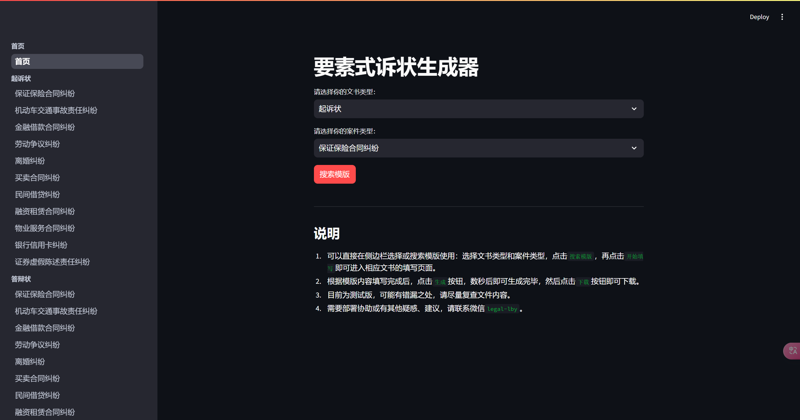

# 要素式诉状生成器

## 简介

要素式诉状生成器是一个基于 Streamlit 的应用程序，旨在帮助用户快速生成符合法律要求的要素式诉状文书。只需选择文书类型和案件类型，填写相关信息，即可生成并下载诉状文件。该工具适用于律师、法务人员以及需要撰写法律文书的个人用户。

## 功能特点

- **多种文书类型支持**：支持多种常见的法律文书类型，如民事诉状、刑事诉状、行政诉状等。
- **多种案件类型支持**：涵盖多种案件类型，如合同纠纷、侵权纠纷、劳动争议等。
- **简单易用**：无需再纠结繁杂信息，也无需复制粘贴☑，只需选择文书类型和案件类型，填写相关信息，即可生成诉状。
- **快速生成**：填写完成后，点击生成按钮，数秒内即可生成诉状文件。
- **下载功能**：生成的诉状文件可直接下载，方便使用。

## 使用方法

1. **选择文书类型和案件类型**：
   - 在主页面上选择所需的文书类型和案件类型。
   - 点击“搜索模版”按钮。

2. **填写诉状内容**：
   - 点击“开始填写”按钮，进入相应的文书填写页面。
   - 根据页面提示，填写相关信息。

3. **生成并下载诉状**：
   - 填写完成后，点击“生成”按钮。
   - 生成完成后，点击“下载”按钮即可下载诉状文件。

## 截图




## 注意事项

- **测试版**：目前为测试版，可能存在错漏之处，请在使用后复查文件内容。
- **联系支持**：如需部署协助或有其他疑惑、建议，请联系微信 `legal-lby`。

## 安装与部署

### 本地运行

1. **克隆仓库**：
   ```bash
   git clone https://github.com/ByronLeeeee/ElementalLegalDocGenerator.git
   cd ElementalLegalDocGenerator
   ```

2. **安装依赖**：
   ```bash
   pip install -r requirements.txt
   ```

3. **运行应用**：
   ```bash
   streamlit run app.py
   ```

### 部署到服务器

1. **安装 Streamlit**：
   ```bash
   pip install streamlit
   ```

2. **运行应用**：
   ```bash
   streamlit run app.py
   ```

3. **配置反向代理**（可选）：
   - 使用 Nginx 或 Apache 配置反向代理，以便通过域名访问应用。

## 贡献

欢迎贡献代码、提出建议或报告问题。请通过以下步骤参与贡献：

## 许可证

本项目采用 [MIT 许可证](LICENSE)。

## 联系方式

如有任何问题或建议，请联系：

- 微信：`legal-lby`
- 邮箱：`liboyang@lslby.com`

